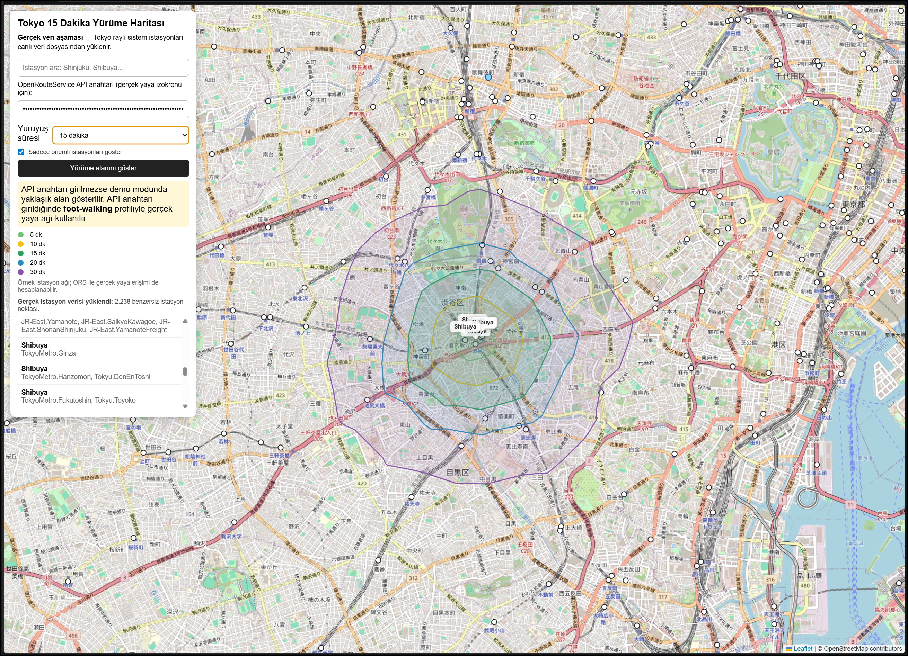

# Walking Map

<div align="center">

[](https://github.com)
[](https://developer.mozilla.org/en-US/docs/Web/JavaScript)
[](https://leafletjs.com/)
[](https://www.openstreetmap.org/)

</div>

A lightweight interactive map prototype that visualizes how far a person can walk from a train station within a 15-minute radius.

This project helps answer a practical urban planning question: how accessible is a location by foot from nearby transit stations?

<p align="center">
  
</p>

## Project at a glance

- Coverage: Tokyo transit stations and nearby walkable areas
- Focus: pedestrian access and station-to-neighborhood mobility
- Output: interactive map with station selection and walking radius
- Status: public prototype for demo, comparison, and early-stage planning

## Live demo

Open the project directly here:

- https://drokian.github.io/walking-map/

<p align="center">
  
</p>

## Why this project?

Walking access is a critical part of urban mobility, livability, and real-estate decision making. This project turns that accessibility into something visible, immediate, and easy to compare.

## Key features

- Real Tokyo station data rendered on a map
- 15-minute walking radius visualization
- Search by station name
- Clickable station list and map selection
- Demo mode with approximate walking area
- Real walking isochrone support via ORS API when an API key is provided
- Interactive popups and labels for selected stations

## Example use cases

- Apartment hunting near transit stations
- Urban planning and access analysis
- Real-estate and commercial location evaluation
- Pedestrian-first neighborhood studies
- Mobility and transport accessibility reviews

## Why it stands out

- Fast, single-page exploration with no heavy setup
- Built for quick urban comparison between station catchments
- Visualizes real walking access in a way that is easy to understand
- Great for demos, ideation, and early-stage neighborhood analysis

## Tech stack

- HTML
- JavaScript
- Leaflet
- OpenStreetMap tiles
- OpenRouteService API

## How it works

1. Open the HTML file in a browser.
2. Station data is loaded from a live source.
3. Search or select a station.
4. The app centers the map on that station and draws a walking area.
5. If an ORS API key is supplied, the app calculates a real walking isochrone; otherwise it falls back to an approximate demo area.

## Run locally

```bash
# Open the HTML file directly in a browser
# or serve it locally with a simple static server
python -m http.server 8000
```

Then open:

```text
http://localhost:8000/tokyo-yurume-haritasi.html
```

## Project status

This is a working prototype focused on concept validation and visual exploration. It is designed to be understandable, easy to extend, and useful for early-stage accessibility analysis.

## Planned improvements

- Add multiple walking durations: 5, 10, 15, 20, and 30 minutes
- Add district and city filters
- Include land-use and station importance layers
- Improve mobile responsiveness
- Expand support to other cities and larger datasets

## Project highlights

- Interactive, map-first walkability exploration
- Station search and filtering for major Tokyo hubs
- Time-based walking access: 5, 10, 15, 20, and 30 minute ranges
- Demo mode and ORS API integration for real isochrone analysis
- Clean single-page interface optimized for quick comparison
- Public GitHub Pages demo for easy access

## Repository features

- [RELEASE_NOTES.md](RELEASE_NOTES.md) for version history
- [CONTRIBUTING.md](CONTRIBUTING.md) for contribution guidance
- [LICENSE](LICENSE) for project licensing
- [docs/walking-map-demo.png](docs/walking-map-demo.png) for repository preview images

## Contributing

Contributions are welcome. If you want to improve the map, expand the data model, or turn this prototype into a more complete accessibility tool, feel free to open an issue or submit a pull request.

See [CONTRIBUTING.md](CONTRIBUTING.md) for the contribution guidelines.

## License

This project is licensed under the [MIT License](LICENSE).

## Release notes

See [RELEASE_NOTES.md](RELEASE_NOTES.md) for the latest changes and version summaries.

## Screenshot

<p align="center">
  
</p>
